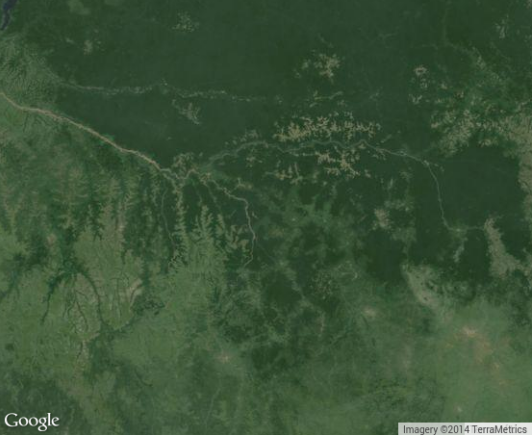

Files and Data
==============
GIS data comes in two main flavours: *vector* and *raster*.

## Vector data
Vector data is used to represent objects such as points, lines and polygons by a set of geographical coordinates. Vector data usually includes attribute values for each object - for example a road number, a village name or the population of province.

Vector data comes in many forms, including:
- `.SHP`: ESRI's shapefile format, a de facto standard for geographic data storage and exchange (in fact it's a set of files with the same name but different extensions, one of which is .shp)
- `.KML/.KMZ`: Keyhole Markup Language, an XML language used in Google Earth and Google Maps
- `.TAB`: MapInfo's file format - as with shapefiles, a set of files, of which one is .TAB.
- a database table
- `.CSV` (comma separated values) files

Vector data can be manipulated, queried, styled, published, processed, and combined, using GIS tools, or in some cases, standard data processing tools such as spreadsheets and databases.

Here's an example of some vector data:  
 

## Raster data
Rasters are images - for example satellite or aerial photographs, or images of maps. They are often used for map backgrounds, but can also be analysed at the pixel level, to, for example, identify land use or cover. We're not going to work with raster data in this workshop.

Here's an example of some raster data: 

## Project Files
Specific GIS tools have their own proprietary formats for files which define the maps they produce - these files contain pointers to the data, styles, etc. For example, ESRI's Arc uses `.mxd` files, which QGIS uses `.qgs` - in QGIS this is called a *Project file*.

> Note that a QGIS project file is actually an XML file, containing references to layers, styling and pretty much everything else that you configure using the QGIS interface. This can be useful, for example, when you want to correct file locations using search and replace.
