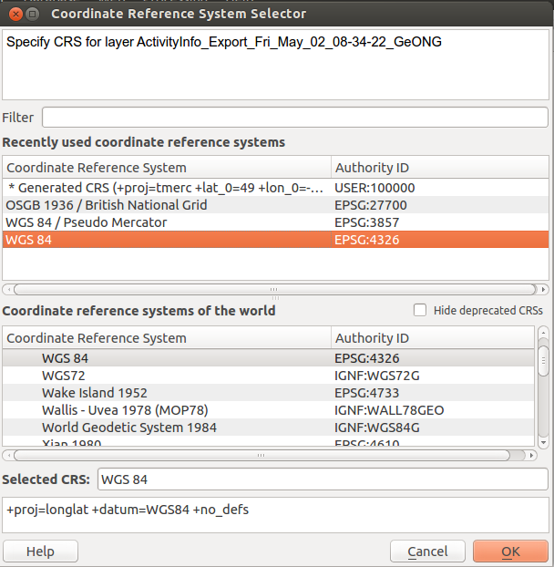
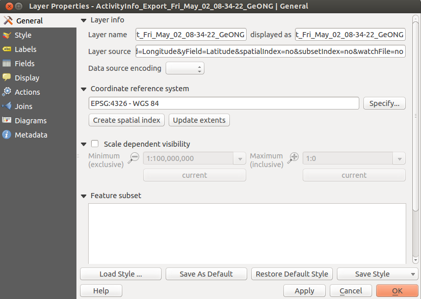

Exercise 1: Loading Data into QGIS
==================================
QGIS will load (and save) most kinds of spatial data. However, often our starting points is some spreadsheet data with coordinates, so we'll start by loading some data into QGIS from a spreadsheet. Let's assume you have been sent some vulnerability analysis data, and you need to load it in order to carry out some analysis.
> *Note*: You can use the buttons down the left-hand of the screen to add various kinds of data layers.

QGIS doesn't work well directly with Excel or other spreadsheet files, but you can load CSV, so if you are working with a spreadsheet, save it as CSV first.

## Load the Data
1. Download the source data from [https://github.com/antonys/antonys.github.io/blob/master/downloads/ActivityInfo_Export_Fri_May_02_08-34-22_GeONG.csv](https://github.com/antonys/antonys.github.io/blob/master/downloads/ActivityInfo_Export_Fri_May_02_08-34-22_GeONG.csv). Right-click on `Raw`, and then `Save as` to save the file. The file contains vulnerability analysis data used by Unicef in the Democratic Republic of Congo.
2. With QGIS open, go to `Layer > Add Layer Add Delimited Text Layer`, and select the data
> *Note*: Loading spreadsheet data is something that can be done in a number of ways in QGIS. As well as the method described here, you can also use `Add Vector Layer` and browse to an Excel file (though all the fields will be imported as strings), or try the `XY tools` plugin.
3. You will see a screen like this 
4. At this stage you can leave all the defaults in place and click `OK`
> *Note*: You will get a message saying there are some errors in the file - this is because some records in the CSV don't have cooordinates - just click `Close` and carry on
5. The next dialogue asks you to confirm which Coordinate Reference System your data is in - as your data contains latitude and longitude data, choose `WGS84` 
6. You have created your first(?) map! However it's very simple at the moment - we'll improve it in the exercises coming up.

## Look at the Data
We'll now have a look at the data in a bit more detail.  
1. Double-click on the layer name in the table of contents on the right-hand side.
2. You will see this screen:  Use it to see the properties of the data, including styling.
3. Click on each of the options on the left to see what is available.
4. When you click on the `Fields` button, you will see a list of the columns from the CSV which you imported
5. Look at each of the fields - there may be some problems with some of them, for example the `Pop_1` column appears as `Text`, instead of an integer field.
6. This is because QGIS makes a guess at the datatype which it should use for each field when it imports it - in this case, because the data had a comma `,` in it, it decided (wrongly) that it was text.
7. This won't be a problem if you just want to display the data - however it will prevent you using the data for calculations, or to drive styling.
8. To fix this, open the data in a spreadsheet, and change the format of `Pop_1` to omit the commas.
9. When you have done this, reload the data and have another look at the fields - the field you have changed should now be showing correctly.
> *Note*: If you want full control over the datatypes (i.e. string, date, integer etc) used by QGIS on importing a CSV file, use a *CSVT* file to set them explicitly.
