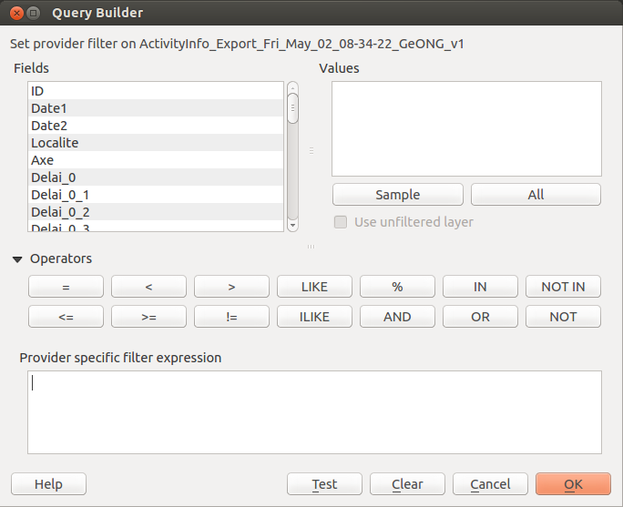

Exercise 3: Using Queries
=========================
Although styling can represent your data in lots of ways, you may also want to manipulate or query the data itself before applying styling. For example you might want to show on the map only those settlements in the data where the population was greater than 1,000, or where an intervention had been carried out in the last 30 days. Of course you could do this in the source data using a spreadsheet, but this would mean going back to the source data and re-loading the data.

QGIS allows us to apply filters and run queries on the data, so that we can view - and if necessary save - a subset of the data we have loaded.

Create a query which returns only those settlements where the population is greater than 1,000.
1. Click on the layer in the Table of Contents to select it, then click `Layer > Query` to apply a query selection to the data
2. You will see a query dialogue 
2. In the Query window, use the dialogue to build a query - this will appear in the lower part of the dialogue
3. In the `Fields` panel, select a field on which to query - for example `Pop_1`, and then use the buttons and the panel below to complete the query
4. You should have a query which looks something like `"Pop_1" > 1000`
5. Click `Test` to make sure the query will return some rows, then click `OK` to run the query against the data
6. The filtered data will appear on the map
7. Try running some other queries on the data to see what results you get
