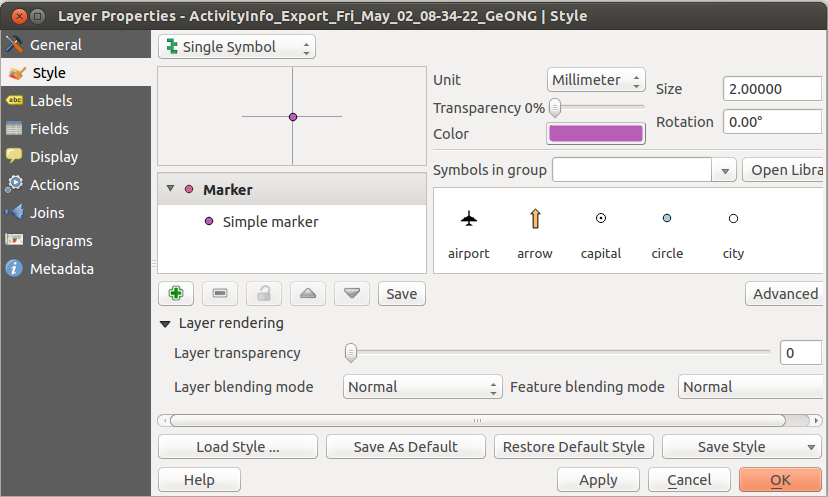
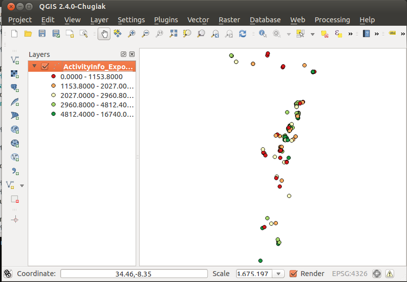

Exercise 2: Adding Style to Data
================================
Now that you have data loaded, you can add some style so that the data is represented on the map in a useful way. We're going to look at two or three styling options and try them out.

> *Note:* Styling is a huge field, and we can only scratch the surface here. If you have time after you have completed the exercises below, explore the other styling options in the `Style` dialogue.

First we'll look at the data itself.
1. Look for the `Open Attribute Table` button in the toolbar, and click it
2. You'll see all the data in the CSV file appearing in the table - so although you have created a map layer, all your source data is still available
3. Double-click on the layer name, and click the `Style` option - you will see a screen like this 
4. This is where you control how the layer appears on the map

The first thing to decide is how you want your styling to be driven - this is set using the button at the top left of the style dialogue.

The options are:
1. `Single symbol`: show all the points in the same way (for example to mark all settlements with a red circle)
2. `Categorized`: show points differently based on the value of one of the fields (for example to show settlements with a different coloured circle depending on the province they are in)
3. `Graduated`: show points differently depending on a classification (for example to show settlements based on the population banding they fall into)

In this exercise, we are going to use the `Graduated` option, but have a look at the others later.

1. Set the button in the top left of the dialogue to `Graduated`
2. In the `Column` field, select `Pop_1` - this is the column we will use to drive the style
3. Choose a `Colour Ramp` to represent the data
4. In the `Mode` field, select `Quantile`
5. Click `Classify` to allocate the data points to the classification value bands
6. Click `OK`
7. Your layer should now look something like this 

Styling needs careful thought to make sure that your map represents the data in a way which is meaningful to the user - this is the art of cartography! In practice this usually means trying out options, and seeing what looks best - then getting some user feedback (e.g. from your neighbour). Spend a few minutes trying out styles.

Here are a few things to look at:
- *Data-driven size*: Use `Advanced > Size scale field` to vary the size of the symbol depending on the value of a field (e.g. `Pop_1`). If the symbols are too big, change the settings for the size of the symbol until it looks right (the method for this depends on the type of styling).
- *Heat map*: Try the `Heat map` option in the style type selector at top left.
- *Symbols*: Use a single symbol, and experiment with the settings to change its appearance. You can also import symbols from elsewhere, using the `Open Library` button.

